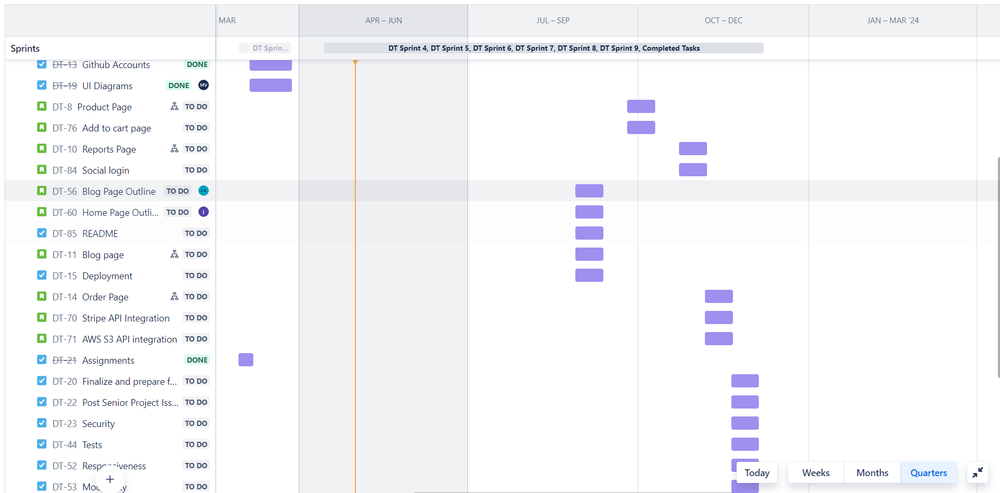
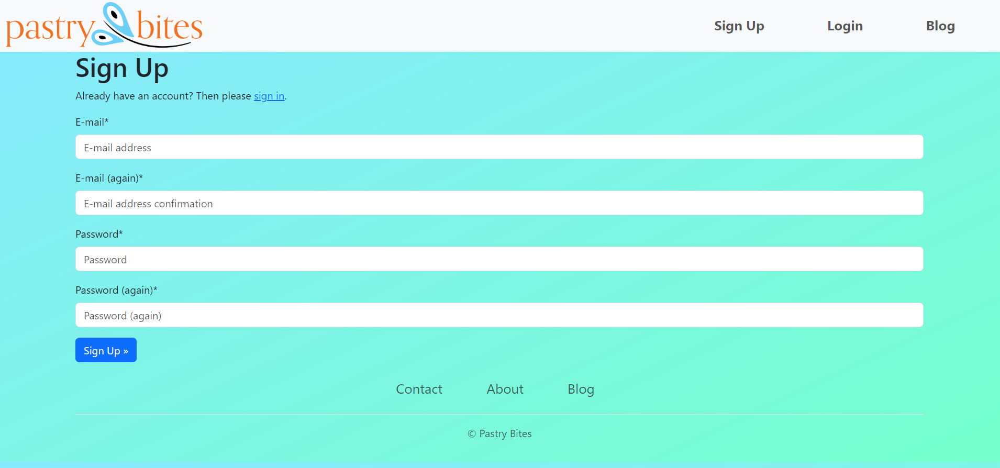
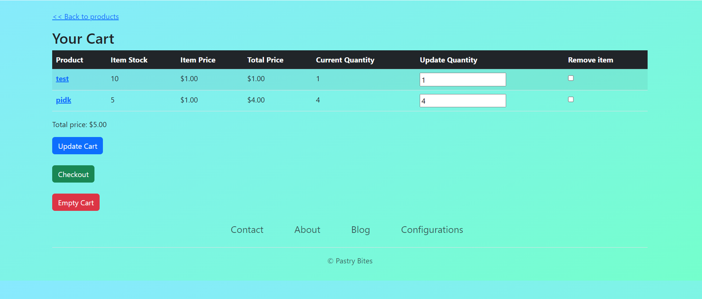
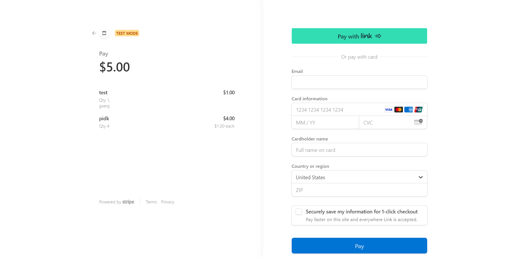
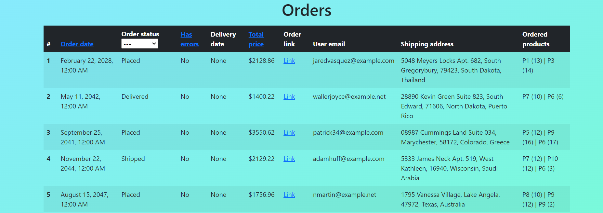
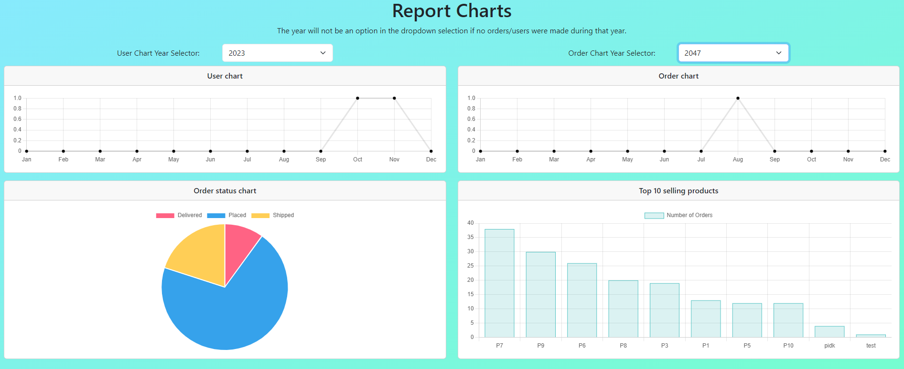

# Pastry Bites: Pastry Ordering Website

## Quick Links
- [Introduction](#introduction)
- [The Client](#the-client)
- [The Team](#the-team)
- [Features](#features)
- [Technologies](#technologies)
- [Testing](#testing)
- [Developer Instructions](#developer-instructions)
- [Project Images](#project-images)

## Introduction
- Sacramento State CSC [190](https://catalog.csus.edu/search/?P=CSC%20190)-[191](https://catalog.csus.edu/search/?P=CSC%20191) Senior Project.
- Pastry Bites is a website that allows customers to order and pay for pastries, while providing a user-friendly interface for managing orders and generating reports for the client (admin).

## The Client
- Cigdem Askin is an individual who is interested in a website that will help her keep manage and track orders she receives. 
- Prior to the website's creation, Cigdem managed orders and customer data using Excel, a process that was both time-consuming and error-prone. Our website now streamlines these tasks by providing real-time order notifications, efficient tracking, secure payments, and data analysis through charts and graphs.

## The Team
- [Muhammad Ahmed](https://github.com/mahmed5499)
- [Jordan Huang](https://github.com/jordanhuang916)
- [Nathan Martinez](https://github.com/nathandevx)
- [Tiffany Nguyen](https://github.com/tiffanypnguyen)
- [Jainish Sanjaykumar Patel](https://github.com/jainish123-pixel)
- [Rahil Patel](https://github.com/rahilpatel29)
- [Moises Vaca](https://github.com/B1ueF10WER)
- [Lovedeep Vasisht](https://github.com/LovedeepVasisht)

## Features
- The admin (client) is able to create, view, filter, and export reports on past orders. They'll be able to view how many orders they've received over a given time period on a graph. 
- Visitors can browse for pastries and eventually register if they'd like to purchase some. 
- Users can change their account information and view previous orders.
- Add to cart feature so users can add multiple items to their cart.
- Checkout and order form so users can enter their information (address, phone number, etc) to purchase the order.
- **User authentication**: Users can register and log in to the website. 
- **User authorization**: We created three user groups to manage access to different sections of the website: visitors, logged in users, and admins. Each group has different levels of access and permissions:
   - **Visitors**: They can view the website, but they're not able to place orders.
   - **Logged-in Users**: In addition to the features available to visitors, logged-in users can place and pay for orders, view their order history, and manage their account settings.
   - **Admins**: Admins have full access to the platform, including an admin dashboard for managing orders, generating reports, and exporting data for further analysis. They can also manage other users and change site settings.

## Technologies
- **Python**: The programming language used to build the backend functionality of the website.
- **Django**: The web framework that provides the tools for creating websites in Python.
- **HTML/CSS**: For structuring and styling the website.
- **JavaScript**: Adds extra interactivity and client side activity (asynchronous calls) to the website.
- **Bootstrap**: For creating responsive and modern UIs.
- **Stripe**: For handling payments securely and maintaining [PCI compliance](https://stripe.com/guides/pci-compliance).
- **AWS S3**: For handling uploaded media (such as product images, generated reports, etc). 
- **Google Maps Embed API**: For showing where the client is located.
- **Heroku PostgreSQL**: For hosting the database.
- **Heroku**: For deploying and hosting the web application.

## Testing
- We used Django's builtin tester for unit and integration tests.
- In order to run the tests yourself, you'll need a .env that contains the necessary environment variables used in the project. If you're the admin, you can find a link to this file in the System Test Report document under the artifacts section.
- Follow the following steps to test the application: 
  - We recommend using Windows 10. We primarily used Windows 10 for running our tests and the development of the website. 
  - **Install Python**: download the latest version of Python (or preferably v3.10) from the [official website](https://www.python.org/downloads/). During the installation process, check the option "Add Python to PATH" to make Python accessible from the command line.
  - **Install Git**: download it at their [official website](https://git-scm.com/downloads).
  - **Download (clone) the project**
    - Open the command prompt and navigate to the folder you want to download the project. 
    - Run “git clone https://github.com/CSC190SeniorProject/SeniorProject” without the quotes.
  - Alternatively, you can download the project as a ZIP file from the [repository page](https://github.com/CSC190SeniorProject/SeniorProject). Click the green code button, then click “Download ZIP”
  - **Preparing the project**
    - Navigate to the project folder via the terminal by running "cd SeniorProject". You should be in the directory that the "README.md" file is in.
    - Setting up the Python virtual environment
      - Create it by running "python -m venv venv".
      - Activate it by running "venv\Scripts\activate".
    - Install the dependencies by running "pip install -r requirements.txt"
    - Set up the database by running "python manage.py migrate"
  - The project is now set up. Read the “Artifacts” section to learn about running the tests. 

## Deployment
- We used Heroku to deploy the application. You can view the deployed application at [pastry-bites-e07af1213853.herokuapp.com](https://pastry-bites-e07af1213853.herokuapp.com/) or at [pastrybitescafe.com](https://pastrybitescafe.com/).
- If you'd like to run the application on your location machine, see the [developer instructions](#developer-instructions).

## Developer Instructions
- This guide is meant for installing and running the site on Windows OS but with minor tweaks it should work on other OS's like Mac and Linux.
- **Install Python**: Download the latest version of Python (or preferably v3.10) from the [official website](https://www.python.org/downloads/). During the installation process, check the option "Add Python to PATH" to make Python accessible from the command line.
- **Install Git**: Download it at their [official website](https://git-scm.com/downloads).
  - **Clone the Repository**: Open the command prompt and navigate to the folder you want to download the project. Run this command without the quotes "git clone https://github.com/CSC190SeniorProject/SeniorProject"
- **Alternative to using Git**: Alternatively, you can download the ZIP file from the [repository page](https://github.com/CSC190SeniorProject/SeniorProject). 
- **Running the site**:
  - Navigate to the project folder via the terminal by running "cd SeniorProject". You should be in the directory that the "README.md" file is in.
  - Setting up the Python virtual environment
    - Create it by running "python -m venv venv".
    - Activate it by running "venv\Scripts\activate".
  - Install the dependencies by running "pip install -r requirements.txt"
  - Set up the database by running "python manage.py migrate"
  - Finally, run the development server by running "python manage.py runserver". It will output a link where you can view the project.

## Project images
- The pages are still in progress and the design has not been finalized yet. We will continue to add more pages and make improvements to them during CSC 191.
- The first image is part of our JIRA roadmap. It shows when we expect certain features to be done. The other images relate to the project.

## JIRA roadmap (part of it)

### Sign up page

### Admin page

### Product page
- The user can view the product and add it to their cart.

### Cart page
- The user's shopping cart.

### Shipping address page
- When a user clicks checkout on their cart page, they are redirected to this page to enter their address.

### Stripe checkout page
- A user is redirected to this page to pay for their order.

### Order page
- This page shows the user what they ordered, an estimated date of delivery, and the total price of their order.

### Orders table
- This page is only accessible by the admin. They can see all the orders they've received and filter them by date, status, total price, etc.

### Charts
- This page is only accessible by the admin. They can see how many orders were placed in a given year, top 10 selling products, etc.

